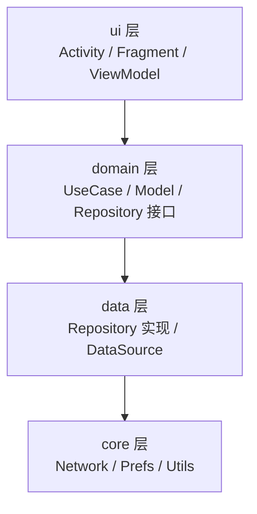
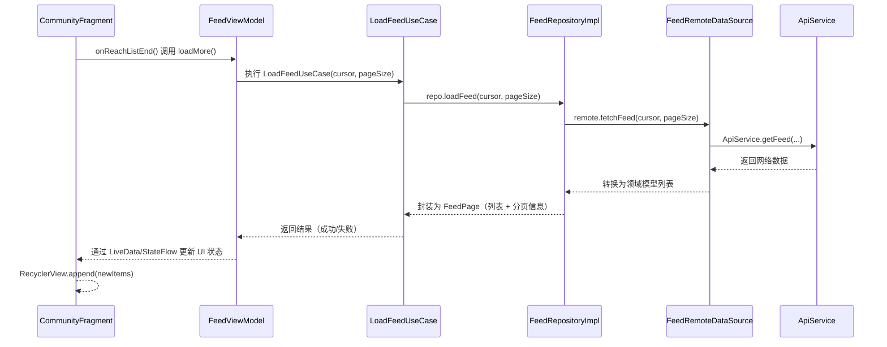

```markdown
# KesongLite - 短视频社区 Demo

> 一个采用 **分层架构（core / domain / data / ui）+ MVVM + Repository** 的 Android Demo 项目，展示短视频流、详情页与用户状态（点赞 / 关注 / 静音）管理。

---

## 目录

1. [项目简介](#项目简介)  
2. [技术栈概览](#技术栈概览)  
3. [架构设计](#架构设计)  
   - [分层架构概览](#分层架构概览)  
   - [包结构说明](#包结构说明)  
   - [数据流转示意](#数据流转示意)  
4. [关键设计点与取舍](#关键设计点与取舍)  
   - [分层方式：按层 + 轻量 feature 子包](#分层方式按层--轻量-feature-子包)  
   - [Repository + UseCase 设计](#repository--usecase-设计)  
   - [本地持久化：SharedPreferences 封装](#本地持久化sharedpreferences-封装)  
   - [媒体播放与详情页设计](#媒体播放与详情页设计)  
5. [主要功能模块说明](#主要功能模块说明)  
   - [Feed 列表（Community / Feed）](#feed-列表community--feed)  
   - [详情页（Detail）](#详情页detail)  
   - [个人页（Me）](#个人页me)  
6. [运行与构建](#运行与构建)  
7. [截图与可视化](#截图与可视化)  
8. [后续优化方向](#后续优化方向)  

---

## 项目简介

**KesongLite** 是一个模拟短视频社区的 Android 应用 Demo，包含：

- 瀑布流 / 列表形式的内容 Feed 展示
- 内容详情页，支持多媒体（图片 / 视频 / 音频预览）
- 用户交互（点赞 / 关注 / 静音）状态的本地持久化
- 简化版本的 Clean Architecture：`core / domain / data / ui` 四层

本项目的重点不在复杂业务，而是通过体量适中的示例，演示 **如何把网络层、模型层、UI 层清晰分离**，并给出实际落地的包结构和职责划分。

---

## 技术栈概览

- **语言**：Kotlin
- **UI 相关**：
  - Activity / Fragment
  - RecyclerView（Feed 列表）、ViewPager/Adapter（详情页滑动）
- **架构模式**：
  - MVVM（ViewModel + Repository + UseCase）
  - 分层架构（core / domain / data / ui）
- **网络**：
  - `core/network/ApiService`，以 Retrofit 风格接口封装后端 API
- **本地持久化**：
  - SharedPreferences 封装：`core/prefs/PrefsManager`
- **通用工具**：
  - `core/util/DateUtils` 等

（具体使用到的三方库以 `build.gradle` 为准）

---

## 架构设计

### 分层架构概览

项目采用 4 层结构，对应职责如下：

- **core 层**：通用基础设施  
  - 网络（ApiService、Retrofit Client 等）
  - 本地存储封装（PrefsManager）
  - 工具类（时间格式化、通用 UI 工具等）

- **domain 层**：业务抽象  
  - 领域模型（Post、Clip、Music、Author…）
  - 业务用例（加载 Feed、刷新、点赞、关注、静音等）

- **data 层**：数据访问与实现  
  - RemoteDataSource：调用网络接口
  - LocalDataSource：使用 PrefsManager 管理本地状态
  - Repository 实现：组装远端、本地数据，向 domain 提供统一接口

- **ui 层**：页面与交互  
  - Activity / Fragment / Adapter / ViewModel
  - 仅依赖 domain 层（UseCase / Repository 接口），不直接操作网络或 SharedPreferences

#### 分层依赖关系图



> 依赖方向自上而下单向，UI 层不会直接依赖 core 层，从而实现网络层、模型层、UI 层的解耦。

---

### 包结构说明

以 `com.example.kesonglite` 为根包，大致结构如下（示意）：

```text
com.example.kesonglite
├── core
│   ├── network/
│   │   └── ApiService.kt            # 定义后端接口
│   ├── prefs/
│   │   └── PrefsManager.kt          # SharedPreferences 统一封装
│   └── util/
│       └── DateUtils.kt             # 通用工具类
│
├── domain
│   ├── model/
│   │   └── DataModels.kt            # Post / Clip / Music 等领域模型
│   └── usecase/
│       ├── feed/
│       │   ├── LoadFeedUseCase.kt
│       │   └── RefreshFeedUseCase.kt
│       └── user/
│           ├── ToggleLikeUseCase.kt
│           ├── ToggleFollowUseCase.kt
│           └── ToggleMuteUseCase.kt
│
├── data
│   ├── feed/
│   │   ├── FeedRemoteDataSource.kt  # 调用 ApiService
│   │   └── FeedRepositoryImpl.kt    # 实现 FeedRepository
│   ├── user/
│   │   ├── UserLocalDataSource.kt   # 基于 PrefsManager 的本地状态
│   │   └── UserRepositoryImpl.kt
│   └── state/
│       ├── AppStateMemory.kt
│       └── StateRepository.kt
│
└── ui
    ├── main/
    │   └── MainActivity.kt
    ├── feed/
    │   ├── CommunityFragment.kt
    │   ├── FeedViewModel.kt
    │   └── FeedAdapter.kt
    ├── detail/
    │   ├── DetailActivity.kt
    │   ├── DetailClipAdapter.kt
    │   └── SliderAdapter.kt
    ├── me/
    │   └── MeFragment.kt
    └── common/
        ├── GridSpacingItemDecoration.kt
        └── SwipeToDismissLayout.kt
```

> **说明**：
> - 顶层按层（core/domain/data/ui）划分，满足“网络层、模型层、UI 层分离”的要求；
> - ui、data、domain 层内部再按业务（feed / detail / me / user）做子包，方便理解和扩展。

---

### 数据流转示意

以「用户滑动到底部加载更多内容」为例：



> 整个过程：
> - **UI 不关心网络细节**，只知道「请求更多内容」；
> - 错误处理、分页信息都在 Repository / UseCase 内部封装。

---

## 关键设计点与取舍

### 分层方式：按层 + 轻量 feature 子包

**设计点**：
- 顶层采用按层分包（core / domain / data / ui），便于区分“基础设施”和“业务”；
- 在 ui、data、domain 层内部对主要业务（feed、detail、me、user）做子包划分。

**取舍理由**：

- 相比「一开始就纯 feature module 化」，当前项目体量偏小，直接上多 module 成本较高；
- 按层分包更接近初学者对 “网络层 / 模型层 / UI 层” 的认知，过渡成本小；
- 为未来扩展预留空间：
    - 需要时可以很自然地把 `ui.feed + data.feed + domain.usecase.feed` 抽成 `:feature-feed` module，而不用推翻包结构。

---

### Repository + UseCase 设计

**设计点**：

- 在 domain 中定义 `FeedRepository` / `UserRepository` 接口及 `LoadFeedUseCase` 等用例；
- 在 data 层实现具体的 `FeedRepositoryImpl` / `UserRepositoryImpl`，负责：
    - 调用网络 / 本地数据源
    - 做必要的数据组装与错误处理

**取舍理由**：

- **优点**：
    - UI 只依赖接口（Repository/UseCase），可测试性好（单测可注入 fake 实现）；
    - 数据来源可替换：以后需要加缓存或本地数据库，只需修改 data 层；
    - UseCase 把「具体业务流程」从 ViewModel 中抽离，便于复用（例如列表页、详情页共用点赞逻辑）。

- **成本**：
    - 多出一层抽象（UseCase/Repository 接口），短期代码量略增；
    - 但长期维护成本更低，且层次更清晰。

---

### 本地持久化：SharedPreferences 封装

**设计点**：

- 使用 `core/prefs/PrefsManager` 对 SharedPreferences 做统一封装；
- 在 `data/user/UserLocalDataSource` 中基于 PrefsManager 提供业务语义方法：
    - `isPostLiked(postId)` / `togglePostLiked(postId)`
    - `isUserFollowed(userId)` / `toggleUserFollowed(userId)`
    - `isMuted()` / `setMuted(isMuted)`

**取舍理由**：

- 对比直接在 UI/Adapter 里操作 SharedPreferences：
    - ✅ 统一 key 管理，减少魔法字符串和 copy-paste；
    - ✅ 便于迁移到其它存储（如 Room、DataStore）；
    - ✅ 防止 UI 层“到处读写 SP”，破坏分层边界。

- 目前业务体量不大，因此暂不引入数据库，**以 SP 为主的轻量方案更简单直接**，也便于 Demo 重点放在架构而不是复杂存储。

---

### 媒体播放与详情页设计

**设计点**：

- 详情页（Detail）相关类集中在 `ui/detail` 包内，包含：
    - `DetailActivity`（或 Fragment）
    - `DetailViewModel`
    - `DetailClipAdapter` / `SliderAdapter`（负责多图或多媒体滑动展示）
- 与用户状态相关的逻辑（关注 / 静音）由 `DetailViewModel` 通过 UseCase 调用 `UserRepository` 完成；
- 媒体播放（音乐、视频）的控制逻辑与 UI 事件解耦，避免 Activity 持有过多状态。

**取舍理由**：

- 详情页是 Feed 构成中的复杂部分，容易出现“Activity 里塞满业务 + 播放器 + 本地状态”的情况；
- 使用 ViewModel + UseCase 管理状态，可以做到：
    - UI 只管展示和交互事件；
    - 播放器相关逻辑可单独抽象，未来替换播放组件（如 ExoPlayer）成本更小。

---

## 主要功能模块说明

### Feed 列表（Community / Feed）

- **UI**：`ui/feed/CommunityFragment` + `FeedAdapter`
- **状态管理**：`FeedViewModel`
    - 维护当前列表数据、加载状态（加载中 / 成功 / 失败 / 无更多）
    - 对外暴露 UIState，Fragment 只根据状态更新 UI
- **数据来源**：`LoadFeedUseCase` / `RefreshFeedUseCase` → `FeedRepositoryImpl` → `FeedRemoteDataSource` → `ApiService`

特点：

- 分页加载逻辑收敛到 ViewModel / UseCase，Fragment 只负责监听滚动事件；
- Adapter 职责单一：只负责展示数据 + 抛出点击事件给 Fragment/VM 处理。

---

### 详情页（Detail）

- **UI**：`ui/detail/DetailActivity` + `DetailClipAdapter` + `SliderAdapter`
- **状态管理**：`DetailViewModel`
    - 控制是否关注、是否静音等用户状态；
    - 跟踪当前展示 clip（如需要）；
- **数据来源**：`UserRepository`（本地持久化） + 可能的网络接口（如后续扩展分享、收藏等）

特点：

- ViewModel 持有领域模型（Post / Clip），详情页只绑定数据和监听点击；
- 媒体播放逻辑可进一步抽象为独立控制类，当前设计已为此预留空间。

---

### 个人页（Me）

- **UI**：`ui/me/MeFragment`
- **职责**：展示用户基础信息、入口等（根据实际工程实现）
- **数据**：后续可通过 `UserRepository` 获取用户相关信息，与 Feed / Detail 使用同一套 user 模块。

---

## 运行与构建

1. **环境要求**

    - Android Studio（推荐使用当前稳定版）
    - JDK 8+
    - Android Gradle Plugin 版本以项目 `build.gradle` 为准

2. **运行步骤**

    - 使用 Android Studio 打开工程根目录；
    - 同步 Gradle（首次会自动下载依赖）；
    - 选择目标运行设备（模拟器或真机）；
    - 点击 **Run** 即可安装并运行应用。

3. **配置说明**

    - 若实际项目使用了线上 API，可在 `core/network/ApiService` 或相关配置文件中修改 baseUrl；
    - 若运行时需要特定权限（如网络、存储），请检查 `AndroidManifest.xml`。

---

## 截图与可视化

> 以下为建议的截图位置与用途，可根据需要补充实际图片。

- Feed 列表页（Community）示意：  
  `docs/screenshots/feed_list.png`
  ```markdown
  
  ```

- 详情页播放示意：  
  `docs/screenshots/detail_page.png`
  ```markdown
  
  ```

- 包结构视图（IDE 侧边栏截图）：  
  `docs/screenshots/project_structure.png`
  ```markdown
  
  ```
---
